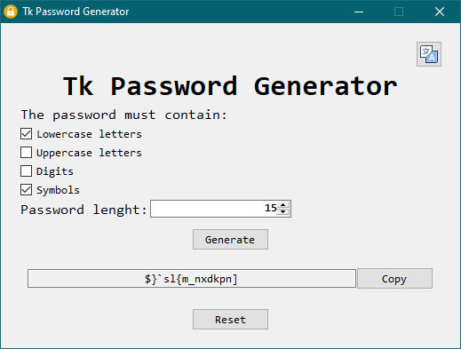
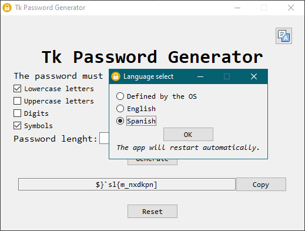
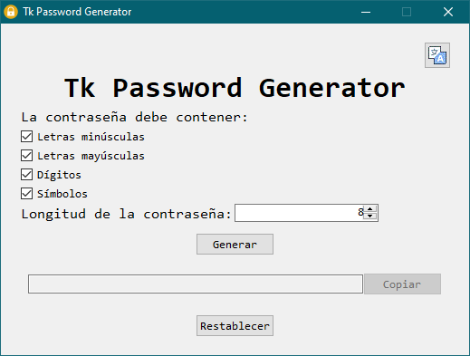

# Tk password Generator
Un generador de contraseñas simple desarrollado con python y tkinter.

Este es mi primer proyecto. Lo hice en Windows. Todavía no lo probé en Linux.

## Las contraseñas
Las contraseñas aleatorias son son generadas con el modulo `secrets` de python, para que sean más seguras. Pueden ser copiadas al portapapeles.  
La longitud de la contraseña es configurable, pudiendo tener entre 1 y 50 caracteres. También el usuario puede decidir se las contraseñas deben incluir minúsculas, mayúsculas, números o símbolos.

## Soporte multilenguage
La aplicación soporta tanto inglés como español. Por defecto, la aplicación estará en inglés si el idioma predeterminado del sistema operativo no es español. El usuario puede forzar un idioma haciendo click en ícono de traducción, en la esquina superior izquierda.

## Copyright
Este programa ha sido liberado bajo la GNU GPL. Lee `LICENSE.MD` para más detalles.

### Íconos usados en la app
Los iconos de candado y de traducción usados en esta app fueron obtenidos de [icons8](https://icons8.com).

## Información del autor
**Rodrigo Pietnechuk**  
- Email: ptnchk.rodrigo@gmail.com  
- URL: https://github.com/ghnoob