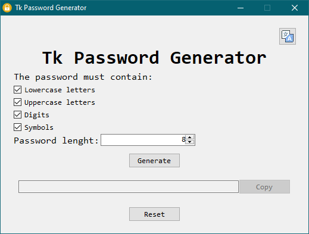
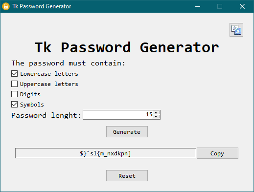
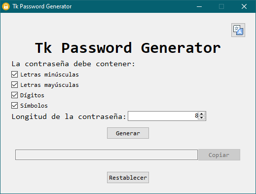

# Tk Password Generator
 A simple password generator made with python and tkinter.

 

 This is my first project. Made it on windows. I didn't try it on Linux (yet).

## The passwords
 The random passwords are generated with the python `secrets` module, and can be copied to the clipboard.  
 The passwords lenght can be 1-50 characters long. They can have uppercase and lowercase letters, digits, and symbols, depending on user choice.

 

## Multi-language support
The app supports both English and Spanish. By default, the app will display its text in English if the OS default language is not Spanish. The user can force a language clicking the translation icon in the upper right corner.

## License
 Released under GNU GPL. See `LICENSE.MD` for details

### Icons used in this app
The lock and translation icons used in this app were obtained from [icons8](https://icons8.com).

## Author info
**Rodrigo Pietnechuk**  
- Email: ptnchk.rodrigo@gmail.com  
- URL: https://github.com/ghnoob